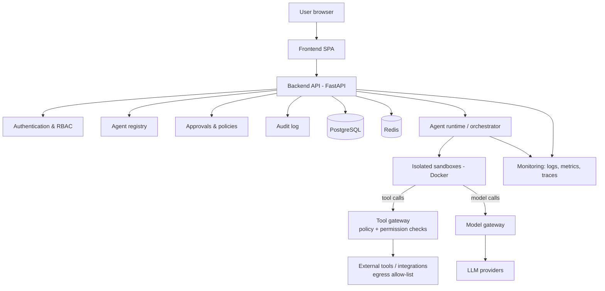

# AgentHub architecture

This document separates what **exists now** from what is **planned**. Planned
components are design intent, not implementations. They are subject to change as
each phase is designed in detail.

- **Document status:** Phase 1 (frontend and UI)
- **Last updated:** 2026-09-15

---

## 1. System overview

### Current implementation

Two independent development services and no shared infrastructure:

```
Browser ──► Vite dev server (127.0.0.1:5173)
              │  serves the React app (demo data via in-memory services)
              └─ proxies /api/* ──► FastAPI (127.0.0.1:8000)
                                      └─ GET /api/v1/health
```

There is no database, authentication, agent execution or external service. Both
services bind to `127.0.0.1` only.

### Planned architecture



Guiding principle: **the backend is the enforcement point.** Identity, permissions,
approvals, budgets and audit are decided server-side. Agents run only in sandboxes
and reach the outside world only through gateways that apply policy.

---

## 2. Frontend

### Current implementation

Phase 1 is complete. Full details are in [docs/FRONTEND.md](docs/FRONTEND.md).

- **Stack:** React 19, strict TypeScript 6, Vite 8, Tailwind CSS 4 design tokens (light/dark), React Router with lazy routes and route error boundaries, TanStack Query, Zustand (theme, sidebar, toasts only), React Hook Form + Zod, lucide-react.
- **Pages:** dashboard, agents (list, details, create, edit), marketplace, executions (list, details), security, analytics, settings, 404.
- **Service layer:** typed contracts in `src/services/contracts.ts`, consumed through `useServices()`. Every contract has an in-memory **demo implementation** (`src/services/demo`). Demo data is centralised in `src/features/demo`, and ESLint forbids UI code from importing it.
- **HTTP client:** `src/services/http/client.ts` is the only `fetch` wrapper. It enforces absolute API paths, a timeout, no credential headers, Zod response validation and typed errors. Its only real use is the Settings connection test against `GET /api/v1/health`.
- **Dev server:** binds to `127.0.0.1` and proxies `/api` to `127.0.0.1:8000`, so no CORS configuration is needed.
- **Not implemented:** backend integration for application data, authentication, real execution, real security scanning.

### Planned architecture

- HTTP implementations of the existing service contracts (Phase 2).
- A typed API client generated from, or validated against, the backend's OpenAPI
  schema, and server-state caching with explicit loading, error and empty states.
- Authentication-aware routing and capability-aware UI (Phase 3). This is UX only;
  enforcement remains server-side.
- Safe rendering of agent output: sanitized Markdown, no raw HTML (Phase 7/8).
- Content Security Policy and security headers at the hosting layer (Phase 8/10).

---

## 3. Backend

### Current implementation

- FastAPI application factory `app.main:create_app`; module-level `app` for Uvicorn.
- Configuration via `pydantic-settings` (`app/core/config.py`): reads environment
  variables and an optional repository-root `.env`, ignores unknown keys, and
  defaults to `ENVIRONMENT=production`.
- One versioned router (`/api/v1`) with `GET /api/v1/health`, returning
  `{status, service, version, message}` through a Pydantic response model.
- API docs (`/api/docs`, `/api/openapi.json`) only when `ENVIRONMENT=development`.
- No CORS middleware, no database, no authentication, no background workers.
- Tooling: pytest (with FastAPI `TestClient` over httpx2), Ruff (including
  flake8-bandit security rules), mypy in strict mode with the Pydantic plugin.

### Planned architecture

- Layered structure: API routers → services (business rules) → repositories (data
  access); Pydantic models at every boundary.
- PostgreSQL persistence with migrations, consistent error responses, request IDs,
  pagination and rate limiting (Phase 2).
- Authentication (sessions or tokens, MFA/SSO options) and role-based access
  control enforced on every endpoint (Phase 3).
- Agent registry, installation and permission-grant APIs (Phase 4).
- Execution orchestration APIs with streaming status updates (Phase 5).

---

## 4. Database

### Current implementation

None. `database/migrations/` and `database/schema/` are empty placeholders. The
backend does not connect to any database.

### Planned architecture

- PostgreSQL as the system of record: organizations, users, memberships, agents,
  versions, installations, permission grants, executions, approvals and audit
  records.
- Versioned migrations stored in `database/migrations/`, applied by CI/CD.
- Tenant isolation enforced in application queries **and** defended in depth with
  row-level security. Membership is verified, not just an organization id.
- The application database role has least privilege. Audit records are append-only
  for the application role.
- Redis for caching, rate limiting and (if selected) job queues.
- Secrets are **not** stored in the database. It holds references to a secret store
  and non-reversible fingerprints.

---

## 5. Agent runtime

### Current implementation

None. `agents/runtime/`, `agents/tools/` and `agents/policies/` are empty
placeholders. **No agent is executed anywhere in the system.**

### Planned architecture

- An orchestrator that manages the execution lifecycle
  (queued → running → waiting for approval → completed / failed / cancelled) as
  durable, resumable jobs.
- Agents are described by manifests: capabilities, tools, required permissions,
  model requirements and resource limits.
- Every tool call an agent proposes goes through a **tool gateway**, which validates
  arguments against a schema, checks the installation's permission grants and
  policies, pauses for human approval when required, and executes the call with
  short-lived, narrowly scoped credentials.
- Every model call goes through a **model gateway**, which handles provider
  selection, budgets, rate limits and usage metering. The provider-specific code sits
  behind a modular adapter interface.
- An organization-wide kill switch enforced by the orchestrator and gateways.

---

## 6. Sandbox

### Current implementation

None. `agents/sandbox/` is an empty placeholder.

### Planned architecture

- One ephemeral, isolated container per execution (Docker in Phase 6; stronger
  isolation such as gVisor or microVMs evaluated later).
- Non-root user, read-only root filesystem, dropped Linux capabilities, `no-new-privileges`,
  seccomp profile, CPU, memory, process and time limits.
- **Never** privileged containers, host networking, host PID or the Docker socket.
- No ambient credentials and no inherited environment variables. Secrets are never
  placed inside the sandbox.
- No direct network access. Egress goes only through the tool/model gateways and an
  allow-list.
- Destroyed after each run. Artefacts are copied out through a controlled channel.

---

## 7. Security

### Current implementation

- Repository rules in `CLAUDE.md` (deny-by-default, no secrets, untrusted
  agent/tool/model data).
- `.gitignore` excludes `.env` files, keys, virtual environments, build output and
  logs. `.env.example` contains placeholders only.
- Backend: secure defaults (production mode unless configured, API docs off outside
  development, no CORS, loopback binding in documented commands). Ruff security
  lint rules.
- Frontend: strict TypeScript, runtime validation of API responses (Zod) and form input it
  consumes, no secrets in browser code.
- CI runs with read-only repository permissions and does not persist checkout
  credentials.
- **Not implemented:** authentication, authorization, CSRF protection, rate limiting,
  security headers or CSP, secret management, dependency or secret scanning in CI.

### Planned architecture

- Server-side authentication and RBAC on every request (Phase 3).
- Policy engine for agent actions, human approvals for high-risk operations, full
  audit trail (Phases 5 and 8).
- Prompt-injection defence in depth: separation of instructions from untrusted
  content, policy enforcement outside the model, egress allow-lists, output
  sanitization, adversarial evaluations (Phases 7 and 8).
- SSRF-safe outbound requests, CSRF protection, rate limiting, security headers/CSP,
  secret store integration, dependency and secret scanning in CI, SHA-pinned CI
  actions (Phase 8).

---

## 8. Monitoring

### Current implementation

- `GET /api/v1/health` as a liveness signal.
- Default Uvicorn console logs.
- No metrics, tracing, alerting or error reporting.

### Planned architecture

- Structured JSON logs with request and trace correlation IDs; secrets and personal
  data are redacted.
- Metrics (request rate, errors, latency, execution counts, token usage, cost) and
  distributed tracing across API → runtime → gateways.
- Liveness and readiness probes, including dependency checks once a database exists.
- Security and audit dashboards and alerting (Phase 9). Tooling is chosen in that
  phase; none is installed now.

---

## 9. Deployment

### Current implementation

- Local development only (Vite dev server and Uvicorn on loopback).
- GitHub Actions CI (`.github/workflows/ci.yml`): frontend install, lint, type check,
  test and build; backend install, lint, format check, type check and test. No
  deployment.
- `infrastructure/` subdirectories are empty placeholders. No Dockerfiles or Compose
  files yet.

### Planned architecture

- Docker images for the backend and frontend, and Compose for local multi-service
  development (introduced when PostgreSQL arrives).
- Separate development, staging and production environments with configuration
  entirely from the environment and a secret manager.
- CD with image scanning, migrations and rollback (Phase 10).
- Frontend served from a static host/CDN with security headers; backend and runtime
  on a container platform with private networking to data stores.

---

## 10. Future scalability

### Current implementation

Not applicable: single-process development services with no state.

### Planned architecture

- A stateless API tier that scales horizontally behind a load balancer.
- Asynchronous, durable execution jobs so long-running agents do not tie up API
  workers.
- A sandbox worker pool that scales independently of the API.
- Cursor-based pagination and server-side search on all collection endpoints.
- Partitioning and retention policies for high-volume tables (executions, tool calls,
  audit).
- Caching and rate limiting in Redis; read replicas when needed.
- Multi-region and data-residency support considered only after production launch.
