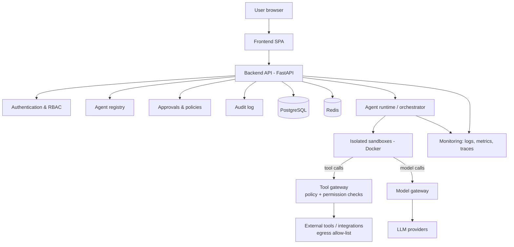

# AgentHub architecture

This document separates what **exists now** from what is **planned**. Planned
components are design intent, not implementations. They are subject to change as
each phase is designed in detail.

- **Document status:** Phase 1 (frontend and UI)
- **Last updated:** 2026-09-15

---

## 1. System overview

### Current implementation

Two independent development services and no shared infrastructure:

```
Browser ──► Vite dev server (127.0.0.1:5173)
              │  serves the React app (demo data via in-memory services)
              └─ proxies /api/* ──► FastAPI (127.0.0.1:8000)
                                      └─ GET /api/v1/health
```

There is no database, authentication, agent execution or external service. Both
services bind to `127.0.0.1` only.

### Planned architecture



Guiding principle: **the backend is the enforcement point.** Identity, permissions,
approvals, budgets and audit are decided server-side. Agents run only in sandboxes
and reach the outside world only through gateways that apply policy.

---

## 2. Frontend

### Current implementation

Phase 1 is complete. Full details are in [docs/FRONTEND.md](docs/FRONTEND.md).

- **Stack:** React 19, strict TypeScript 6, Vite 8, Tailwind CSS 4 design tokens (light/dark), React Router with lazy routes and route error boundaries, TanStack Query, Zustand (theme, sidebar, toasts only), React Hook Form + Zod, lucide-react.
- **Pages:** dashboard, agents (list, details, create, edit), marketplace, executions (list, details), security, analytics, settings, 404.
- **Service layer:** typed contracts in `src/services/contracts.ts`, consumed through `useServices()`. Every contract has an in-memory **demo implementation** (`src/services/demo`). Demo data is centralised in `src/features/demo`, and ESLint forbids UI code from importing it.
- **HTTP client:** `src/services/http/client.ts` is the only `fetch` wrapper. It enforces absolute API paths, a timeout, no credential headers, Zod response validation and typed errors. Its only real use is the Settings connection test against `GET /api/v1/health`.
- **Dev server:** binds to `127.0.0.1` and proxies `/api` to `127.0.0.1:8000`, so no CORS configuration is needed.
- **Not implemented:** backend integration for application data, authentication, real execution, real security scanning.

### Planned architecture

- HTTP implementations of the existing service contracts (Phase 2).
- A typed API client generated from, or validated against, the backend's OpenAPI
  schema, and server-state caching with explicit loading, error and empty states.
- Authentication-aware routing and capability-aware UI (Phase 3). This is UX only;
  enforcement remains server-side.
- Safe rendering of agent output: model and tool text is rendered as plain text
  today (Phase 7); sanitized Markdown may follow, never raw HTML.
- Content Security Policy in the built app and on API responses (Phase 8); the
  host must also send `frame-ancestors` as a header (Phase 10).

---

## 3. Backend

### Current implementation

- FastAPI application factory `app.main:create_app`; `app.main:app` is built on
  first access, so importing the module never requires configuration.
- Configuration via `pydantic-settings` (`app/core/config.py`): reads environment
  variables and an optional repository-root `.env`, ignores unknown keys, and
  defaults to `ENVIRONMENT=production`.
- Versioned router (`/api/v1`): health, agents and executions. Layering is
  routers → services (business rules, risk scoring) → repositories (queries);
  Pydantic models at every boundary, camelCase on the wire.
- Persistence with SQLAlchemy 2 (async) and Alembic migrations: SQLite for local
  development and tests, PostgreSQL for staging and production.
- Cross-cutting: `{code, message, details}` error envelope that never leaks
  internals, `X-Request-ID` middleware feeding structured JSON logs, security
  headers, and offset pagination (`{items, total, limit, offset}`).
- Server-side validation is authoritative: permission completeness, egress
  allow-lists, status transitions and risk scores are decided by the backend.
  Requesting an execution records a queued row; nothing runs.
- API docs (`/api/docs`, `/api/openapi.json`) only when `ENVIRONMENT=development`.
- Agent runtime (Phase 5): a database-backed queue and worker that walks each
  run step by step, enforces the budget it was given, pauses for human approval,
  honours cancellation and an organization-wide kill switch, and records a
  timeline, logs and tool calls.
- Security layer (Phase 8): a policy engine that enforces each agent's declared
  security policy, an SSRF-safe egress gateway (the only way a request leaves
  the server), an append-only audit log, CSP and security headers, per-client
  write limits, and secret files. See §7, [docs/THREAT_MODEL.md](docs/THREAT_MODEL.md).
- Model gateway (Phase 7): tiers route to Claude or OpenAI models through
  official SDKs; every request is rate limited, budgeted and metered per
  organization. A tool gateway checks every tool call the model makes and
  executes none. See §5.
- Sandbox (Phase 6): before a run's first step the engine starts an isolated
  container, checks it from the inside, and fails the run if any isolation
  check fails. Nothing executes inside it yet.
- Agent registry (Phase 4): immutable published manifests, marketplace
  listings governed by a visibility setting, and installations that record what
  an organization granted - never more than the manifest requested, and nothing
  by default.
- Authentication and authorization (Phase 3): password sign-in with scrypt,
  opaque server-side sessions in HttpOnly cookies, CSRF tokens on every unsafe
  request, sign-in throttling, and a role matrix (viewer < member < admin <
  owner) checked on every endpoint. Agents and executions are scoped to one
  organization in every query.
- No CORS middleware, no MFA or SSO, no email delivery (so no password reset),
  no audit log and no background workers.
- Tooling: pytest (with FastAPI `TestClient` over httpx2), Ruff (including
  flake8-bandit security rules), mypy in strict mode with the Pydantic plugin.

### Planned architecture

- Layered structure: API routers → services (business rules) → repositories (data
  access); Pydantic models at every boundary.
- Rate limiting and CORS configuration for a separate frontend origin.
- MFA and SSO, password reset by email, and an audit trail of security-relevant
  decisions.
- Execution orchestration APIs with streaming status updates (Phase 5).

---

## 4. Database

### Current implementation

- `organizations`, `users`, `memberships`, `sessions`, `agents`,
  `agent_versions`, `installations`, `executions`, `execution_events`,
  `execution_logs`, `execution_tool_calls` and `execution_approvals` tables,
  created by Alembic migrations in `database/migrations/versions/`.
- Passwords are scrypt hashes; session and CSRF tokens are stored only as
  SHA-256 fingerprints. Sessions record no IP address or user agent.
- Configuration documents (model, tools, permissions, limits, policy, versions,
  security checks) are JSON columns: `JSON` on SQLite, `JSONB` on PostgreSQL.
- `executions.agent_id` references `agents.id` with `ON DELETE CASCADE`; SQLite
  connections enable `PRAGMA foreign_keys=ON` so local behaviour matches
  PostgreSQL.
- Local development defaults to a SQLite file; `infrastructure/compose/` runs
  PostgreSQL 17 on loopback for a production-like setup. Production requires
  `DATABASE_URL` and refuses to start without it.
- No permission-grant, approval or audit tables yet.

### Planned architecture

- PostgreSQL as the system of record: organizations, users, memberships, agents,
  versions, installations, permission grants, executions, approvals and audit
  records.
- Versioned migrations stored in `database/migrations/`, applied by CI/CD.
- Tenant isolation enforced in application queries **and** defended in depth with
  row-level security. Membership is verified, not just an organization id.
- The application database role has least privilege. Audit records are append-only
  for the application role.
- Redis for caching, rate limiting and (if selected) job queues.
- Secrets are **not** stored in the database. It holds references to a secret store
  and non-reversible fingerprints.

---

## 5. Agent runtime

### Current implementation

`backend/app/runtime/` holds a database-backed queue (claim, committed
per-step progress, heartbeats during long steps, reclaim, a retry cap), per-run
budgets, approval pauses, cancellation at step boundaries and the organization
kill switch.

- **Model-driven runs.** When the agent's tier routes to a provider with
  credentials, `agent_loop.py` drives the run one unit at a time - one model
  turn or one tool call - saving the conversation between steps. Every model
  call goes through the **model gateway** (`backend/app/llm/`): tier routing,
  provider adapters behind a neutral interface, per-organization rate and daily
  token limits, and a usage ledger with estimated cost.
- **The tool gateway** checks each tool call against the agent's grants and a
  strict per-tool schema, then the **policy engine** (§7) decides from the
  agent's declared security policy. Only `api_request` runs - a read-only GET
  through the egress gateway - and every other allowed tool is recorded as not
  executed.
- **Simulated runs.** Without a provider the scripted plan is recorded, and the
  run says so.

`agents/runtime/`, `agents/tools/` and `agents/policies/` remain empty
placeholders.

### Planned architecture

- An orchestrator that manages the execution lifecycle
  (queued → running → waiting for approval → completed / failed / cancelled) as
  durable, resumable jobs.
- Agents are described by manifests: capabilities, tools, required permissions,
  model requirements and resource limits.
- Every tool call an agent proposes goes through a **tool gateway**, which validates
  arguments against a schema, checks the installation's permission grants and
  policies, pauses for human approval when required, and executes the call with
  short-lived, narrowly scoped credentials.
- Every model call goes through a **model gateway**, which handles provider
  selection, budgets, rate limits and usage metering. The provider-specific code sits
  behind a modular adapter interface.
- An organization-wide kill switch enforced by the orchestrator and gateways.

---

## 6. Sandbox

### Current implementation

- **Image** (`agents/sandbox/`): Alpine Python with a fixed unprivileged
  account (uid/gid 65532) and one program, `probe.py`, which reports what the
  container can do. It contains no agent code.
- **Container spec** (`backend/app/sandbox/spec.py`): the arguments every
  container is started with, as a pure function - `--rm`, `--user 65532:65532`,
  `--cap-drop ALL`, `no-new-privileges`, `--read-only` with a `noexec` tmpfs,
  `--network none`, memory (no swap), CPU and process limits, and labels
  tracing it to its run. No mounts, no socket, no `--env`. A final gate refuses
  `--privileged`, host namespaces, `--cap-add`, volumes, devices and the socket.
- **Runner** (`backend/app/sandbox/runner.py`): drives the runtime's CLI with
  no stdin, a timeout (after which the container is force-removed) and capped
  output.
- **Verification** (`backend/app/sandbox/report.py`): the probe's answers are
  judged outside the container into 13 checks. Anything unreported counts as a
  failure. The engine records the report on the run; a container that fails a
  check fails the run (`sandbox_unsafe`); with no runtime the run is a
  simulation, or is refused when `REQUIRE_SANDBOX=true`.
- **Where it is proven:** the arguments, runner and engine behaviour are tested
  without a daemon; the `sandbox` CI job starts real containers and requires
  every check to pass.
- **Not yet:** a custom seccomp profile (Docker's default applies), user
  namespace remapping, gVisor or microVMs, an egress gateway, and anything
  running inside the box.

### Planned architecture

- One ephemeral, isolated container per execution (Docker in Phase 6; stronger
  isolation such as gVisor or microVMs evaluated later).
- Non-root user, read-only root filesystem, dropped Linux capabilities, `no-new-privileges`,
  seccomp profile, CPU, memory, process and time limits.
- **Never** privileged containers, host networking, host PID or the Docker socket.
- No ambient credentials and no inherited environment variables. Secrets are never
  placed inside the sandbox.
- No direct network access. Egress goes only through the tool/model gateways and an
  allow-list.
- Destroyed after each run. Artefacts are copied out through a controlled channel.

---

## 7. Security

### Current implementation

- Repository rules in `CLAUDE.md` (deny-by-default, no secrets, untrusted
  agent/tool/model data).
- `.gitignore` excludes `.env` files, keys, virtual environments, build output and
  logs. `.env.example` contains placeholders only.
- Backend: secure defaults (production mode unless configured, API docs off outside
  development, no CORS, loopback binding in documented commands). Ruff security
  lint rules.
- Frontend: strict TypeScript, runtime validation of API responses (Zod) and form input it
  consumes, no secrets in browser code.
- CI runs with read-only repository permissions and does not persist checkout
  credentials.
- Authentication, role-based authorization, CSRF protection and sign-in
  throttling (Phase 3); execution isolation checks (Phase 6, §6).
- Security layer (Phase 8): the policy engine decides every agent action from
  facts a model cannot change; the egress gateway refuses anything but HTTPS
  GETs to allow-listed hosts on public addresses, with pinned connections and
  no redirects; fetched content is labelled untrusted; an append-only audit log
  records security decisions; CSP and security headers everywhere; per-client
  write limits; secrets from file mounts. Threat model and review:
  [docs/THREAT_MODEL.md](docs/THREAT_MODEL.md),
  [docs/SECURITY_REVIEW.md](docs/SECURITY_REVIEW.md).
- **Not implemented:** vault-based secret management, rate limits shared across
  processes, prevention (rather than containment) of prompt injection, and any
  independent security review or penetration test.

### Planned architecture

- Server-side authentication and RBAC on every request (Phase 3).
- Policy engine for agent actions, human approvals for high-risk operations, full
  audit trail (Phases 5 and 8).
- Prompt-injection defence in depth: separation of instructions from untrusted
  content, policy enforcement outside the model, egress allow-lists, output
  sanitization, adversarial evaluations (Phases 7 and 8).
- SSRF-safe outbound requests, CSRF protection, rate limiting, security headers/CSP,
  secret store integration, dependency and secret scanning in CI, SHA-pinned CI
  actions (Phase 8).

---

## 8. Monitoring

### Current implementation

- `GET /api/v1/health` (liveness) and `GET /api/v1/health/ready` (the
  database answers).
- JSON logs with request, trace and span ids; messages, fields and exceptions
  are redacted of credentials and emails (`app/observability/redaction.py`).
- Prometheus metrics at `GET /api/v1/metrics`, from a private registry with
  bounded labels, closed by `METRICS_TOKEN` (required in production).
- OpenTelemetry spans: HTTP requests (continuing `traceparent`), run steps,
  sandbox probes, model calls and outbound requests. They are exported over
  OTLP/HTTP when `OTLP_ENDPOINT` is set, and the trace id is returned in
  `X-Trace-Id`.
- Alert rules evaluated per organization by the worker, stored in `alerts`,
  shown on the Security screen, optionally sent to an HTTPS webhook through
  the egress gateway, and mirrored in
  `infrastructure/monitoring/prometheus-rules.yml`.
- Live component status (`GET /api/v1/system/status`) and security and
  analytics endpoints behind the dashboards.

See [docs/MONITORING.md](docs/MONITORING.md).

### Planned architecture

- Running Prometheus, Grafana and an OpenTelemetry collector as part of the
  deployment (Phase 10), log shipping and retention, and an error reporting
  service.
- Paging integrations, and alerting on metrics aggregated across processes.

---

## 9. Deployment

### Current implementation

Written and statically checked, **not yet run**. See
[docs/DEPLOYMENT.md](docs/DEPLOYMENT.md).

- Images: `agenthub-backend` (API, migrations, worker code), `agenthub-web`
  (Caddy with the built SPA), `agenthub-sandbox`
  (`infrastructure/docker/`, `agents/sandbox/`).
- One Debian 13 host per environment (staging, production), running
  `infrastructure/deployment/compose.yml`: web, backend, optional PostgreSQL,
  Prometheus. All read-only, non-root, capability-free, with an internal
  service network.
- The runtime worker on the host (systemd), not in a container, driving a
  rootless Docker daemon owned by a separate account. It reports its
  capabilities to the API through `runtime_workers` and serves its own metrics.
- CI builds, scans, load-tests and publishes images by digest with provenance.
  The Deploy workflow promotes staging, then production behind approval. The
  host's deploy script backs up, migrates, health-checks and rolls back.

### Planned architecture

- Provenance verified at deploy time; host egress rules for the API container.
- Several hosts behind a load balancer once rate limits move to a shared store.
- A managed PostgreSQL with point-in-time recovery as the default.

---

## 10. Future scalability

### Current implementation

Not applicable: single-process development services with no state.

### Planned architecture

- A stateless API tier that scales horizontally behind a load balancer.
- Asynchronous, durable execution jobs so long-running agents do not tie up API
  workers.
- A sandbox worker pool that scales independently of the API.
- Cursor-based pagination and server-side search on all collection endpoints.
- Partitioning and retention policies for high-volume tables (executions, tool calls,
  audit).
- Caching and rate limiting in Redis; read replicas when needed.
- Multi-region and data-residency support considered only after production launch.
